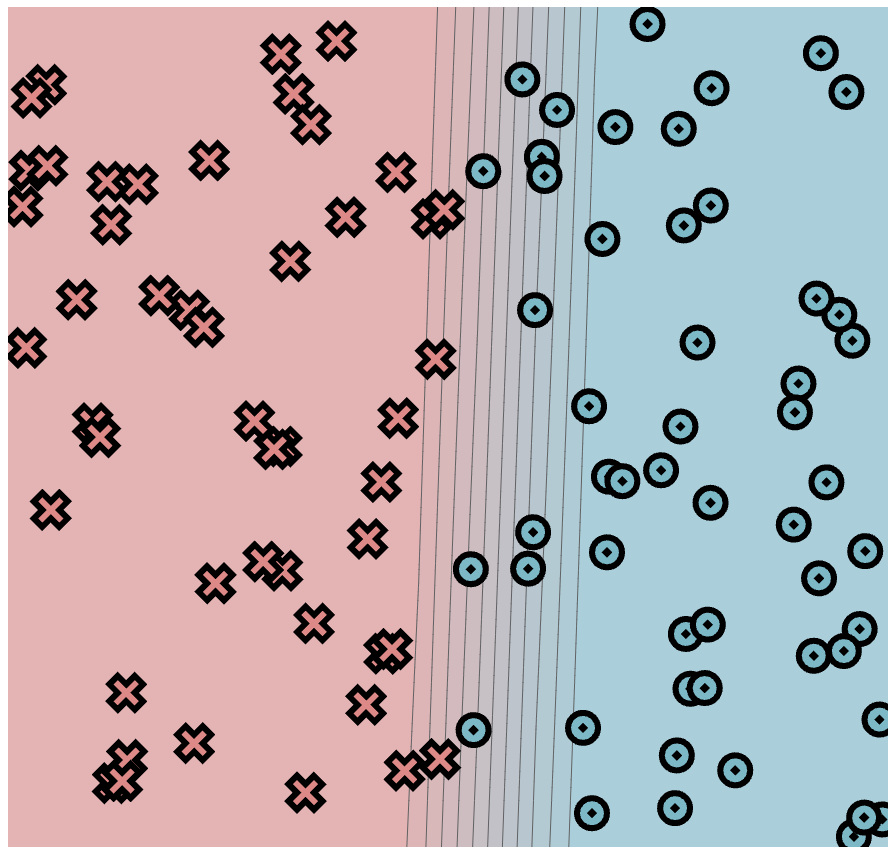

[](https://classroom.github.com/a/YFgwt0yY)
# MiniTorch Module 2


* Docs: https://minitorch.github.io/

* Overview: https://minitorch.github.io/module2/module2/

This assignment requires the following files from the previous assignments. You can get these by running

```bash
python sync_previous_module.py previous-module-dir current-module-dir
```

The files that will be synced are:

        minitorch/operators.py minitorch/module.py minitorch/autodiff.py minitorch/scalar.py minitorch/scalar_functions.py minitorch/module.py project/run_manual.py project/run_scalar.py project/datasets.py

## Task 2.5: Model Trainings

A model is trained for each of the following datasets: Simple, Diagonal, Split, and XOR.

Several models are trained for each dataset with different configurations and the best results are included below for this part of the assignment.

### Task 2.5.1: Simple Dataset Model Training

- Number of points: 100
- Size of hidden layer: 3
- Learning rate: 0.05
- Number of epochs: 600

#### Classification Results



#### Loss Results


#### Resulted Time Per Epoch

Time per epoch: 0.070s

#### Output logs:

Epoch: 0/600, loss: 0, correct: 0
Epoch: 10/600, loss: 69.09427546142183, correct: 47
Epoch: 20/600, loss: 68.31263399474054, correct: 50
Epoch: 30/600, loss: 67.52341720960659, correct: 55
Epoch: 40/600, loss: 66.82222540796877, correct: 63
Epoch: 50/600, loss: 66.22266179997493, correct: 65
Epoch: 60/600, loss: 65.64918724367078, correct: 66
Epoch: 70/600, loss: 65.13197592322177, correct: 67
Epoch: 80/600, loss: 64.69831084850762, correct: 68
Epoch: 90/600, loss: 64.23810504544278, correct: 68
Epoch: 100/600, loss: 63.748292004000334, correct: 71
Epoch: 110/600, loss: 63.22230909947481, correct: 71
Epoch: 120/600, loss: 62.67488731424547, correct: 73
Epoch: 130/600, loss: 62.09836104485979, correct: 73
Epoch: 140/600, loss: 61.46676806420322, correct: 74
Epoch: 150/600, loss: 60.7849070218741, correct: 75
Epoch: 160/600, loss: 60.05126184981369, correct: 77
Epoch: 170/600, loss: 59.26200759885225, correct: 78
Epoch: 180/600, loss: 58.418006146402874, correct: 79
Epoch: 190/600, loss: 57.50973657658048, correct: 80
Epoch: 200/600, loss: 56.54030270406518, correct: 80
Epoch: 210/600, loss: 55.4971684982817, correct: 82
Epoch: 220/600, loss: 54.375986315265294, correct: 83
Epoch: 230/600, loss: 53.17147057483851, correct: 83
Epoch: 240/600, loss: 51.9155768310898, correct: 83
Epoch: 250/600, loss: 50.598273464796634, correct: 83
Epoch: 260/600, loss: 49.23738126309288, correct: 83
Epoch: 270/600, loss: 47.82956309786448, correct: 84
Epoch: 280/600, loss: 46.36663774838643, correct: 85
Epoch: 290/600, loss: 44.86182300454131, correct: 86
Epoch: 300/600, loss: 43.3234381503132, correct: 86
Epoch: 310/600, loss: 41.74585857334833, correct: 86
Epoch: 320/600, loss: 40.13483559920197, correct: 88
Epoch: 330/600, loss: 38.501449267873326, correct: 89
Epoch: 340/600, loss: 36.87584905406591, correct: 90
Epoch: 350/600, loss: 35.26955277999194, correct: 92
Epoch: 360/600, loss: 33.67707676185342, correct: 92
Epoch: 370/600, loss: 32.1416122140908, correct: 93
Epoch: 380/600, loss: 30.64137026571714, correct: 93
Epoch: 390/600, loss: 29.190882245300074, correct: 94
Epoch: 400/600, loss: 27.790957833313037, correct: 96
Epoch: 410/600, loss: 26.670597005936767, correct: 96
Epoch: 420/600, loss: 25.6298637954512, correct: 96
Epoch: 430/600, loss: 24.661717934259627, correct: 96
Epoch: 440/600, loss: 23.74368937728737, correct: 97
Epoch: 450/600, loss: 22.904768333647908, correct: 97
Epoch: 460/600, loss: 22.138131384490087, correct: 97
Epoch: 470/600, loss: 21.400209097332983, correct: 97
Epoch: 480/600, loss: 20.728774208754505, correct: 98
Epoch: 490/600, loss: 20.08853935840539, correct: 98
Epoch: 500/600, loss: 19.493182509862923, correct: 98
Epoch: 510/600, loss: 18.922800680597533, correct: 98
Epoch: 520/600, loss: 18.37951327197918, correct: 99
Epoch: 530/600, loss: 17.86845875570205, correct: 99
Epoch: 540/600, loss: 17.393835129040397, correct: 99
Epoch: 550/600, loss: 16.952869488211544, correct: 99
Epoch: 560/600, loss: 16.53626143063904, correct: 99
Epoch: 570/600, loss: 16.142134339322894, correct: 99
Epoch: 580/600, loss: 15.765800370675185, correct: 99
Epoch: 590/600, loss: 15.403689794557325, correct: 99
Epoch: 600/600, loss: 15.06091744784487, correct: 100

### Task 2.5.2: Diagonal Dataset Model Training

- Number of points: 100
- Size of hidden layer: 7
- Learning rate: 0.1
- Number of epochs: 400

#### Classification Results


#### Loss Results


#### Resulted Time Per Epoch

Time per epoch: 0.220s

#### Output logs:

Epoch: 0/400, loss: 0, correct: 0
Epoch: 10/400, loss: 31.488280966128606, correct: 87
Epoch: 20/400, loss: 29.5351948118052, correct: 87
Epoch: 30/400, loss: 28.357954880364293, correct: 87
Epoch: 40/400, loss: 27.20620881017958, correct: 87
Epoch: 50/400, loss: 26.018605959646987, correct: 87
Epoch: 60/400, loss: 24.7972996789731, correct: 87
Epoch: 70/400, loss: 23.49699762472687, correct: 87
Epoch: 80/400, loss: 22.063105636611365, correct: 87
Epoch: 90/400, loss: 20.69336545965406, correct: 89
Epoch: 100/400, loss: 19.469166777685803, correct: 90
Epoch: 110/400, loss: 18.45608544295946, correct: 91
Epoch: 120/400, loss: 17.60522496952948, correct: 91
Epoch: 130/400, loss: 16.838347966684015, correct: 92
Epoch: 140/400, loss: 16.13243489824051, correct: 93
Epoch: 150/400, loss: 15.481327616596918, correct: 93
Epoch: 160/400, loss: 14.865726575945924, correct: 94
Epoch: 170/400, loss: 14.284994560663314, correct: 94
Epoch: 180/400, loss: 13.73728346629905, correct: 95
Epoch: 190/400, loss: 13.215176715564137, correct: 95
Epoch: 200/400, loss: 12.720422784942787, correct: 95
Epoch: 210/400, loss: 12.254451713467072, correct: 95
Epoch: 220/400, loss: 11.814265541343643, correct: 95
Epoch: 230/400, loss: 11.407894565302099, correct: 95
Epoch: 240/400, loss: 11.028709664512464, correct: 96
Epoch: 250/400, loss: 10.671544235588815, correct: 97
Epoch: 260/400, loss: 10.333423958846177, correct: 97
Epoch: 270/400, loss: 10.012089285093014, correct: 98
Epoch: 280/400, loss: 9.706568136980309, correct: 98
Epoch: 290/400, loss: 9.408262792055334, correct: 98
Epoch: 300/400, loss: 9.127181125162265, correct: 98
Epoch: 310/400, loss: 8.858539732024322, correct: 98
Epoch: 320/400, loss: 8.600537486414346, correct: 98
Epoch: 330/400, loss: 8.360782088595723, correct: 98
Epoch: 340/400, loss: 8.13901446982103, correct: 98
Epoch: 350/400, loss: 7.929052288532293, correct: 98
Epoch: 360/400, loss: 7.728629334972162, correct: 98
Epoch: 370/400, loss: 7.537056285075312, correct: 98
Epoch: 380/400, loss: 7.353696498464767, correct: 98
Epoch: 390/400, loss: 7.1785223426826255, correct: 98
Epoch: 400/400, loss: 7.011022418487695, correct: 98

### Task 2.5.3: Split Dataset Model Training

- Number of points: 150
- Size of hidden layer: 10
- Learning rate: 0.1
- Number of epochs: 500

#### Classification Results


#### Loss Results


#### Resulted Time Per Epoch

Time per epoch: 0.574s

#### Output logs:

Epoch: 0/500, loss: 0, correct: 0
Epoch: 10/500, loss: 93.89540324249101, correct: 120
Epoch: 20/500, loss: 91.20024605277585, correct: 103
Epoch: 30/500, loss: 89.87694376477083, correct: 103
Epoch: 40/500, loss: 88.69682860924166, correct: 104
Epoch: 50/500, loss: 87.46659671498834, correct: 105
Epoch: 60/500, loss: 86.13537655012297, correct: 105
Epoch: 70/500, loss: 84.71587542887873, correct: 105
Epoch: 80/500, loss: 83.22556756672736, correct: 106
Epoch: 90/500, loss: 81.6049944327692, correct: 112
Epoch: 100/500, loss: 79.86923794680278, correct: 114
Epoch: 110/500, loss: 78.00454612315274, correct: 117
Epoch: 120/500, loss: 76.04528918004343, correct: 123
Epoch: 130/500, loss: 73.98816243287303, correct: 125
Epoch: 140/500, loss: 71.82408884247941, correct: 127
Epoch: 150/500, loss: 69.5726290425464, correct: 130
Epoch: 160/500, loss: 67.23155403979918, correct: 132
Epoch: 170/500, loss: 64.80349212016557, correct: 132
Epoch: 180/500, loss: 62.327520903989374, correct: 134
Epoch: 190/500, loss: 59.791105051536334, correct: 136
Epoch: 200/500, loss: 57.22142229956749, correct: 137
Epoch: 210/500, loss: 54.66578150386352, correct: 138
Epoch: 220/500, loss: 52.15118834431949, correct: 139
Epoch: 230/500, loss: 49.70200154805417, correct: 141
Epoch: 240/500, loss: 47.30921966619448, correct: 141
Epoch: 250/500, loss: 45.01342170622675, correct: 142
Epoch: 260/500, loss: 42.823357155408694, correct: 143
Epoch: 270/500, loss: 40.751612510354285, correct: 144
Epoch: 280/500, loss: 38.79962491963556, correct: 145
Epoch: 290/500, loss: 36.965724147242014, correct: 147
Epoch: 300/500, loss: 35.25716812984153, correct: 148
Epoch: 310/500, loss: 33.668070066046624, correct: 148
Epoch: 320/500, loss: 32.186472398093166, correct: 148
Epoch: 330/500, loss: 30.807618804446737, correct: 148
Epoch: 340/500, loss: 29.523384919089157, correct: 148
Epoch: 350/500, loss: 28.328262418964616, correct: 149
Epoch: 360/500, loss: 27.21449999240538, correct: 149
Epoch: 370/500, loss: 26.177783038125007, correct: 149
Epoch: 380/500, loss: 25.210832741355787, correct: 149
Epoch: 390/500, loss: 24.30695821368026, correct: 149
Epoch: 400/500, loss: 23.46158586126207, correct: 149
Epoch: 410/500, loss: 22.66991337988712, correct: 149
Epoch: 420/500, loss: 21.927710573267213, correct: 149
Epoch: 430/500, loss: 21.230520917069942, correct: 149
Epoch: 440/500, loss: 20.574661892029372, correct: 149
Epoch: 450/500, loss: 19.957010568951073, correct: 149
Epoch: 460/500, loss: 19.374598940798965, correct: 149
Epoch: 470/500, loss: 18.824827599750435, correct: 149
Epoch: 480/500, loss: 18.304098747892215, correct: 149
Epoch: 490/500, loss: 17.81026808619097, correct: 149
Epoch: 500/500, loss: 17.34076289537878, correct: 149

### Task 2.5.4: XOR Dataset Model Training

- Number of points: 150
- Size of hidden layer: 10
- Learning rate: 0.05
- Number of epochs: 1200

#### Classification Results


#### Loss Results


#### Resulted Time Per Epoch

Time per epoch: 0.567s

#### Output logs:

Epoch: 0/1200, loss: 0, correct: 0
Epoch: 10/1200, loss: 103.38896105134704, correct: 73
Epoch: 20/1200, loss: 101.62240096436096, correct: 80
Epoch: 30/1200, loss: 100.42012214395311, correct: 89
Epoch: 40/1200, loss: 99.4795725221756, correct: 106
Epoch: 50/1200, loss: 98.63023737063322, correct: 107
Epoch: 60/1200, loss: 97.84984369972395, correct: 106
Epoch: 70/1200, loss: 97.14463469919802, correct: 108
Epoch: 80/1200, loss: 96.4215685532699, correct: 108
Epoch: 90/1200, loss: 95.76211088559607, correct: 110
Epoch: 100/1200, loss: 95.18777926335441, correct: 111
Epoch: 110/1200, loss: 94.5747204611421, correct: 113
Epoch: 120/1200, loss: 93.93786501331151, correct: 117
Epoch: 130/1200, loss: 93.27913297427709, correct: 118
Epoch: 140/1200, loss: 92.61758715203129, correct: 116
Epoch: 150/1200, loss: 91.90902507691223, correct: 115
Epoch: 160/1200, loss: 91.19959538101168, correct: 115
Epoch: 170/1200, loss: 90.45848524619628, correct: 113
Epoch: 180/1200, loss: 89.6380919977679, correct: 115
Epoch: 190/1200, loss: 88.76474012865317, correct: 116
Epoch: 200/1200, loss: 87.83525277969386, correct: 116
Epoch: 210/1200, loss: 86.84368585333151, correct: 118
Epoch: 220/1200, loss: 85.82224771604761, correct: 121
Epoch: 230/1200, loss: 84.84050503472086, correct: 122
Epoch: 240/1200, loss: 83.8313660056068, correct: 123
Epoch: 250/1200, loss: 82.82863712955466, correct: 125
Epoch: 260/1200, loss: 81.79970655098397, correct: 127
Epoch: 270/1200, loss: 80.77689503222827, correct: 129
Epoch: 280/1200, loss: 79.75480243517627, correct: 129
Epoch: 290/1200, loss: 78.71871272926157, correct: 129
Epoch: 300/1200, loss: 77.69399542321436, correct: 130
Epoch: 310/1200, loss: 76.65059755414414, correct: 131
Epoch: 320/1200, loss: 75.59419256931515, correct: 132
Epoch: 330/1200, loss: 74.52764798942128, correct: 133
Epoch: 340/1200, loss: 73.45533629196262, correct: 135
Epoch: 350/1200, loss: 72.36821156736322, correct: 137
Epoch: 360/1200, loss: 71.28192105118328, correct: 137
Epoch: 370/1200, loss: 70.18243819729351, correct: 137
Epoch: 380/1200, loss: 69.07896515681611, correct: 138
Epoch: 390/1200, loss: 67.97284423134026, correct: 139
Epoch: 400/1200, loss: 66.85862126911466, correct: 139
Epoch: 410/1200, loss: 65.73975007058324, correct: 139
Epoch: 420/1200, loss: 64.62060000527907, correct: 139
Epoch: 430/1200, loss: 63.501968177105944, correct: 140
Epoch: 440/1200, loss: 62.38408424493163, correct: 140
Epoch: 450/1200, loss: 61.268381801896744, correct: 140
Epoch: 460/1200, loss: 60.15543822043802, correct: 140
Epoch: 470/1200, loss: 59.05600566949331, correct: 140
Epoch: 480/1200, loss: 57.97589839282993, correct: 142
Epoch: 490/1200, loss: 56.910228309204236, correct: 142
Epoch: 500/1200, loss: 55.85822177227291, correct: 143
Epoch: 510/1200, loss: 54.822656717244314, correct: 143
Epoch: 520/1200, loss: 53.80186999343538, correct: 143
Epoch: 530/1200, loss: 52.80284143817372, correct: 144
Epoch: 540/1200, loss: 51.82691684132868, correct: 144
Epoch: 550/1200, loss: 50.87195558768884, correct: 144
Epoch: 560/1200, loss: 49.935818017878105, correct: 144
Epoch: 570/1200, loss: 49.02163698551775, correct: 144
Epoch: 580/1200, loss: 48.131890466510185, correct: 144
Epoch: 590/1200, loss: 47.2653469674125, correct: 144
Epoch: 600/1200, loss: 46.420088343387064, correct: 144
Epoch: 610/1200, loss: 45.59670964390199, correct: 144
Epoch: 620/1200, loss: 44.79447389914982, correct: 144
Epoch: 630/1200, loss: 44.018528108486144, correct: 144
Epoch: 640/1200, loss: 43.2689760368799, correct: 144
Epoch: 650/1200, loss: 42.53986713088634, correct: 144
Epoch: 660/1200, loss: 41.83053551841926, correct: 144
Epoch: 670/1200, loss: 41.14118917867768, correct: 145
Epoch: 680/1200, loss: 40.47120075320898, correct: 145
Epoch: 690/1200, loss: 39.82093264127456, correct: 145
Epoch: 700/1200, loss: 39.188124890800324, correct: 145
Epoch: 710/1200, loss: 38.57292510858838, correct: 145
Epoch: 720/1200, loss: 37.97496776023992, correct: 145
Epoch: 730/1200, loss: 37.3950166250396, correct: 145
Epoch: 740/1200, loss: 36.831271282254036, correct: 145
Epoch: 750/1200, loss: 36.282511543007715, correct: 145
Epoch: 760/1200, loss: 35.74810902600774, correct: 145
Epoch: 770/1200, loss: 35.22812888886108, correct: 145
Epoch: 780/1200, loss: 34.722071433632884, correct: 145
Epoch: 790/1200, loss: 34.22944094510439, correct: 145
Epoch: 800/1200, loss: 33.75002760292058, correct: 145
Epoch: 810/1200, loss: 33.2823718734537, correct: 145
Epoch: 820/1200, loss: 32.826443740979435, correct: 145
Epoch: 830/1200, loss: 32.38171012556923, correct: 145
Epoch: 840/1200, loss: 31.947790319477352, correct: 145
Epoch: 850/1200, loss: 31.5244989559418, correct: 145
Epoch: 860/1200, loss: 31.11143399936045, correct: 146
Epoch: 870/1200, loss: 30.708128569599417, correct: 146
Epoch: 880/1200, loss: 30.314667305629094, correct: 146
Epoch: 890/1200, loss: 29.930277472967703, correct: 146
Epoch: 900/1200, loss: 29.554069833305014, correct: 146
Epoch: 910/1200, loss: 29.186438647408597, correct: 146
Epoch: 920/1200, loss: 28.826801690480877, correct: 146
Epoch: 930/1200, loss: 28.474841823940945, correct: 146
Epoch: 940/1200, loss: 28.13021014219206, correct: 146
Epoch: 950/1200, loss: 27.793679564986967, correct: 146
Epoch: 960/1200, loss: 27.463364874233534, correct: 146
Epoch: 970/1200, loss: 27.13984520803368, correct: 146
Epoch: 980/1200, loss: 26.823248519721083, correct: 146
Epoch: 990/1200, loss: 26.51304046149275, correct: 146
Epoch: 1000/1200, loss: 26.2088663222475, correct: 146
Epoch: 1010/1200, loss: 25.91073888538342, correct: 146
Epoch: 1020/1200, loss: 25.6183291633222, correct: 146
Epoch: 1030/1200, loss: 25.331502736798456, correct: 146
Epoch: 1040/1200, loss: 25.05021458456975, correct: 146
Epoch: 1050/1200, loss: 24.775694657799427, correct: 146
Epoch: 1060/1200, loss: 24.50682533747598, correct: 146
Epoch: 1070/1200, loss: 24.24329689489303, correct: 146
Epoch: 1080/1200, loss: 23.984766549340375, correct: 146
Epoch: 1090/1200, loss: 23.730875587824066, correct: 146
Epoch: 1100/1200, loss: 23.4814876445377, correct: 146
Epoch: 1110/1200, loss: 23.23685580131688, correct: 146
Epoch: 1120/1200, loss: 22.996387168765544, correct: 146
Epoch: 1130/1200, loss: 22.76048160254503, correct: 146
Epoch: 1140/1200, loss: 22.528598618799506, correct: 147
Epoch: 1150/1200, loss: 22.300848950539127, correct: 147
Epoch: 1160/1200, loss: 22.07711413405095, correct: 147
Epoch: 1170/1200, loss: 21.857279514420675, correct: 147
Epoch: 1180/1200, loss: 21.641407511758057, correct: 147
Epoch: 1190/1200, loss: 21.42873760042425, correct: 147
Epoch: 1200/1200, loss: 21.220093908813507, correct: 147